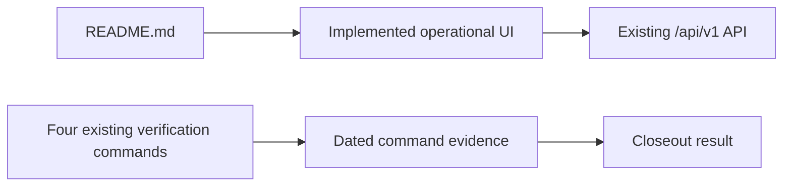

# Design Document: Project Closeout Documentation Validation

## Overview

This closeout updates documentation and records reproducible verification evidence for the already implemented operational web UI. It is intentionally a documentation-and-validation change: it neither changes UI behavior nor expands the existing `/api/v1` backend.

The work proceeds in a low-risk order:

1. Update `README.md` to replace obsolete starter-page and REST-only statements with accurate operational UI guidance.
2. Capture the source revision at the start of closeout validation, then run the four existing verification commands exactly once each, unchanged, and record their evidence.
3. Classify the closeout result from the four captured exit statuses and close the change without implementing deferred capability.

## Architecture

The implementation already separates browser UI surfaces from the existing API. This closeout documents that established boundary rather than modifying it.



`app/page.tsx` mounts `components/access/access-shell.tsx`, which presents login, mandatory password change, and role-specific entry states. Authorized operational navigation is provided by `components/access/role-navigation.tsx`; operational routes live below `app/operaciones/`, while employee QR response routes live below `app/scan/`. These implementation references support accurate documentation only. No route, API client, service, repository, schema, or configuration change is part of this design.

## Components and Interfaces

| Item | Planned action | Responsibility |
| --- | --- | --- |
| `README.md` | Modify | Describe the implemented browser UI: role-based login, mandatory password change, user and branch administration, questionnaire/version/QR management, employee QR response submission, and reports. Replace obsolete claims that the UI is a starter page or REST-only. State that the UI consumes existing `/api/v1` endpoints and that this closeout makes no backend change. |
| `.kiro/specs/project-closeout-documentation-validation/verification-<UTC-timestamp>.md` | Create during validation | Preserve one dated evidence record for the complete validation. Use `verification-YYYY-MM-DDTHH-mm-ssZ.md`, for example `verification-2026-08-03T13-30-00Z.md`; the filename timestamp is UTC to seconds and is filesystem-safe. |
| `app/page.tsx`, `components/access/access-shell.tsx`, `components/access/role-navigation.tsx`, `app/operaciones/**`, `app/scan/**` | No change | Evidence sources for the README’s UI claims; they remain unchanged. |

The README will name capabilities at an operational level, not expose internal client-state details or imply new API contracts. It will retain existing API documentation where useful, while making the browser workflow the primary local usage path.

Validation uses this fixed command sequence with no retries, substitutions, or argument changes:

1. `pnpm test`
2. `pnpm exec tsc --noEmit`
3. `pnpm lint`
4. `pnpm build`

Each command is invoked exactly once. Completion of a command with a nonzero exit status does not stop the sequence: every remaining command is still invoked once so that the evidence represents all four commands.

## Data Models

No application data model changes are required. The planned Markdown evidence record uses this documentation-only structure:

```text
Closeout validation started at: YYYY-MM-DDTHH:mm:ss+00:00
Source revision identifier: <revision captured at validation start>
Overall validation result: passed | not passed

Commands:
  1. Command as executed: pnpm test
     Completed at: YYYY-MM-DDTHH:mm:ss+00:00
     Exact exit status: <integer>
     Output summary: <failed when nonzero; no more than 2,000 characters>
  2. Command as executed: pnpm exec tsc --noEmit
     Completed at: YYYY-MM-DDTHH:mm:ss+00:00
     Exact exit status: <integer>
     Output summary: <failed when nonzero; no more than 2,000 characters>
  3. Command as executed: pnpm lint
     Completed at: YYYY-MM-DDTHH:mm:ss+00:00
     Exact exit status: <integer>
     Output summary: <failed when nonzero; no more than 2,000 characters>
  4. Command as executed: pnpm build
     Completed at: YYYY-MM-DDTHH:mm:ss+00:00
     Exact exit status: <integer>
     Output summary: <failed when nonzero; no more than 2,000 characters>
```

All record timestamps use ISO 8601 date-time values with seconds precision and an explicit UTC offset (`+00:00`). The source revision identifier is captured once from the checked-out revision when closeout validation begins and is repeated unchanged in the record. Exactly one evidence entry is retained for each command completion; therefore, the record contains exactly four command entries. A nonzero status must be retained, must be identified as failed in that command's output summary, and produces an overall result of `not passed`. The result is `passed` only when all four recorded exit statuses are zero.

## Correctness Properties

### Property 0: Not Applicable

No property-based testing is applicable to this documentation-and-command-evidence change. The work updates human-readable documentation and records outcomes from side-effecting repository commands; it does not introduce pure business logic or a meaningful input space with universal invariants. No executable correctness properties are defined for this feature.

**Validates: Requirements 1.1, 1.2, 1.3, 2.1, 2.2, 2.3, 2.4, 3.1, 3.2**

## Error Handling

Documentation must be based on the implemented UI routes and components, not assumptions. If any capability cannot be confirmed from the implementation, the README update must omit or qualify it rather than overstate behavior.

The validation process continues through the fixed four-command sequence after any failure. For each nonzero exit status, it retains the command's single evidence entry, labels the output summary as failed, records the exact status, and marks the final closeout result as `not passed`. It does not rerun a command, change command arguments, substitute a command, or remediate failures within this closeout.

## Testing Strategy

| Layer | Verification | Method |
| --- | --- | --- |
| Documentation review | README accurately represents the implemented operational UI and its `/api/v1` boundary. | Compare the proposed README text against the listed UI routes and components; confirm it removes starter-page and REST-only claims. |
| Repository verification | Existing tests, type checking, linting, and production build. | Execute the fixed sequence exactly once per command and without argument changes, even after an earlier nonzero exit status. Record one evidence entry per completion using the specified timestamp, revision, status, and summary format. |
| Closeout result | Evidence is complete and truthfully classified. | Confirm exactly four evidence entries exist, one for each specified command. Mark `passed` only if all four captured exit statuses are zero; otherwise mark `not passed`. |

## Deferred Scope and Closeout

The following eight deferred scope items are individually identifiable and are not implemented by this closeout:

| Deferred scope item | Closeout status | Admission control |
| --- | --- | --- |
| Refresh authentication | Deferred | Requires a separate approved decision identifying refresh authentication and a separate Kiro specification identifying it before design or implementation. |
| Persisted authentication state | Deferred | Requires a separate approved decision identifying persisted authentication state and a separate Kiro specification identifying it before design or implementation. |
| Cookies | Deferred | Requires a separate approved decision identifying cookies and a separate Kiro specification identifying them before design or implementation. |
| BFF | Deferred | Requires a separate approved decision identifying the BFF and a separate Kiro specification identifying it before design or implementation. |
| Logout | Deferred | Requires a separate approved decision identifying logout and a separate Kiro specification identifying it before design or implementation. |
| Server Actions | Deferred | Requires a separate approved decision identifying Server Actions and a separate Kiro specification identifying them before design or implementation. |
| Backend changes | Deferred | Requires a separate approved decision identifying backend changes and a separate Kiro specification identifying them before design or implementation. |
| Physical QR scanning | Deferred | Requires a separate approved decision identifying physical QR scanning and a separate Kiro specification identifying it before design or implementation. |

Deferred status blocks design and implementation work for each listed item until both approvals exist. This governance does not expand closeout scope or authorize preparatory implementation work for a deferred item.

No migration, rollout, API change, source-code change, configuration change, or backend behavior change is required for this closeout.
